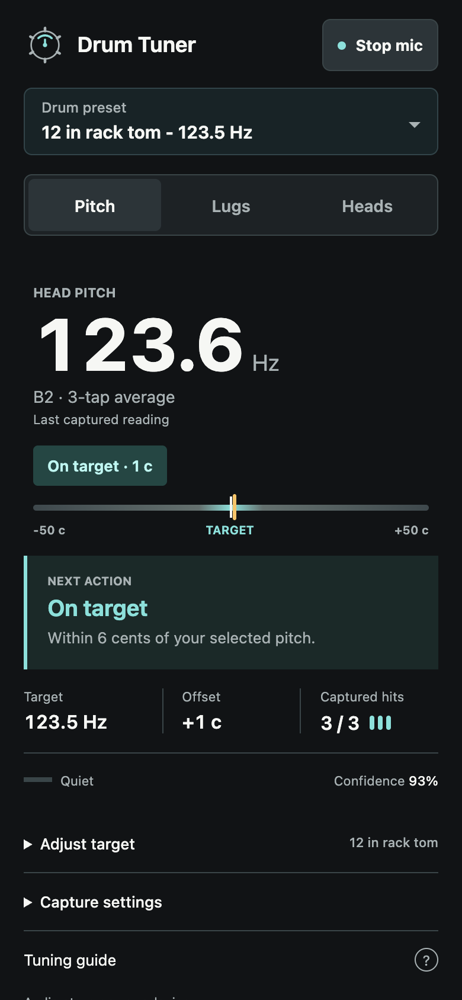
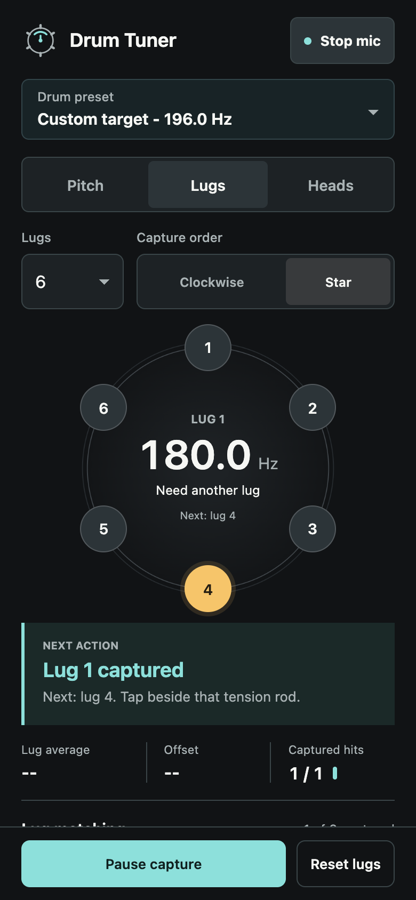

# Drum Tuner

Drum Tuner is a mobile-first browser app for tuning acoustic drums with the device microphone. It captures drum hits on-device with the Web Audio API, estimates the dominant drumhead frequency, scores hit confidence, averages repeated takes, and supports pitch, lug, and batter/resonant head tuning workflows without sending microphone audio to a server.

Live demo: [https://drum-tuner.pages.dev](https://drum-tuner.pages.dev)

## Screenshots

| Pitch tuning | Guided lug capture |
| --- | --- |
|  |  |

These screens use generated audio in a browser test. They demonstrate the
interface, not verified accuracy on a physical drum.

## About

This project explores how close a web app can get to a dedicated instrument tuner while staying deployable as static assets. The core tuning path runs in the browser: microphone capture, hit segmentation, quality checks, modal-frequency scanning, YIN-style pitch estimation, and UI rendering all happen locally.

The app is designed for tuning taps rather than full-performance drum hits. It includes rejection paths for weak, clipped, and low-confidence strikes, but the DSP thresholds still need field calibration against real drums and reference tuners before release-quality claims.

## Tech Stack

- HTML, CSS, and vanilla JavaScript ES modules
- Web Audio API with `AudioWorklet` for low-latency mic capture
- Canvas for the lug/head diagrams, waveform, and spectrum; DOM/CSS for the pitch scale
- localStorage for local settings and named kit/drum tunings
- Cloudflare Pages for static HTTPS deployment
- Wrangler CLI for deployment

## Engineering Highlights

- On-device audio processing, so live tuning does not depend on a backend round trip.
- `AudioWorklet` hit capture with pre-roll, decay capture, cooldown, noise-floor tracking, and clipping checks.
- Analyzer fallback for browsers where `AudioWorklet` is unavailable.
- Drum-specific hit quality scoring for weak, clipped, and low-confidence strikes.
- Modal-frequency scanning plus YIN-style pitch estimation with estimator agreement scoring.
- Repeated-hit averaging with confidence and take count to reduce single-strike variance.
- Large pitch readout with a labeled target scale and explicit next action; incomplete or unstable pitch readings are withheld.
- Guided lug tuning with 6, 8, and 10 lug layouts, clockwise/star sequences, and a fixed reference from the first stable lug (or a saved target).
- Batter/resonant head capture with an editable pitch-ratio starting point.
- Measured-pitch filter lock, enabled only after a stable reading; preset targets cannot bias octave selection.
- Local kit saves for drum targets, lug reference, completed head readings, and head goal.
- Responsive tuning controls, microphone permission recovery, and keyboard-accessible mode tabs.
- HTTPS deployment headers that allow microphone access from the app origin.

## Architecture

See [docs/architecture.md](docs/architecture.md) for the runtime model, deployment shape, constraints, and a C4-style container diagram.

Architecture decisions are documented in [docs/adrs/README.md](docs/adrs/README.md).

## Run Locally

```sh
python3 -m http.server 5173 --bind 127.0.0.1
```

Open `http://127.0.0.1:5173/`.

## Validation

There is no build step or production package dependency. Run the analysis and
lug-sequencing regression tests with Node.js:

```sh
node --check app.js
node --check drum-audio-worklet.js
node --test tests/tuner.test.cjs
git diff --check
```

The browser suite in `tests/browser.mjs` uses separately installed Playwright
tooling and a running local server. Set `PLAYWRIGHT_MODULE` to the absolute path
of Playwright's `index.mjs`, then run `node tests/browser.mjs`.
Use `BROWSER=webkit` for WebKit or `FALLBACK=1` to exercise analyzer fallback.
Use `INPUT_RATE=48000` to generate a 48 kHz microphone stream, or
`OMIT_INPUT_RATE=1` to test a stream without sample-rate metadata. The fixture
otherwise reports its actual sample rate, as a microphone may do.
Screenshots go to `/tmp/drum-tuner-review` by default; override with
`SCREENSHOT_DIR`.

These tests cover generated decaying tones, not certified real-drum accuracy.
See [product validation](docs/product-validation.md) for evidence and remaining
release checks.

## Use On iPhone

iPhone mic access in Safari requires a secure context. `localhost` works on the same machine, but a phone on your network needs HTTPS.

Good options:

- Use the Cloudflare Pages demo URL.
- Deploy the folder to any HTTPS static host.
- Use a temporary HTTPS tunnel while developing.

For whole-drum pitch, leave both heads free and tap near the center. After a stable reading, optionally lock the filter to that measured pitch; switching drums or modes clears the lock. For lug tuning, lightly mute the center and capture equal-distance taps near each rod. The first stable lug sets a fixed reference, which can be changed explicitly. For separate head readings, mute the opposite head and tap the selected head. Head-ratio goals are editable starting points, not predictions of sustain.

## Deployment

This repository is deployed as a static Cloudflare Pages site. There is no build
step. For a manual deployment, package only the public assets so local editor
and indexing files cannot be uploaded:

```sh
SITE_DIR="$(mktemp -d)"
mkdir -p "$SITE_DIR/assets"
cp index.html styles.css app.js drum-audio-worklet.js manifest.webmanifest _headers _routes.json "$SITE_DIR/"
cp assets/drum-mark.svg "$SITE_DIR/assets/"
npx wrangler pages deploy "$SITE_DIR" --project-name drum-tuner --branch main
```

The Cloudflare `_headers` file sets:

- `Permissions-Policy: microphone=(self)`
- `X-Content-Type-Options: nosniff`
- `Referrer-Policy: strict-origin-when-cross-origin`

## Privacy

Microphone audio is processed in the browser. The app does not upload raw audio, tuning readings, or settings to a backend. Settings and named kit tunings are stored locally with `localStorage`; they do not sync across devices and can be removed by clearing browser data.

## Limitations

- The tuner has not yet been validated against a broad field dataset of drums, rooms, iPhone models, and reference tuners.
- Browser audio constraints such as echo cancellation and automatic gain control are requested, but browser and operating system behavior can vary.
- Hard rimshots, very close phone placement, and reflective rooms can still produce clipped or unstable readings.
- There is no account system, cloud preset sync, analytics, or server-side DSP.

## Project Structure

```text
.
├── index.html              # App shell and controls
├── styles.css              # Responsive UI and tuner layout
├── app.js                  # UI state, pitch analysis, tuning workflows
├── drum-audio-worklet.js   # AudioWorklet hit capture and level tracking
├── manifest.webmanifest    # PWA metadata
├── _headers                # Cloudflare Pages security/mic headers
├── _routes.json            # Cloudflare Pages routing config
├── assets/                 # Original app mark and documented UI screenshots
├── tests/                  # DSP and browser regression checks
└── docs/
    ├── architecture.md
    ├── product-validation.md
    └── adrs/
        └── README.md
```
