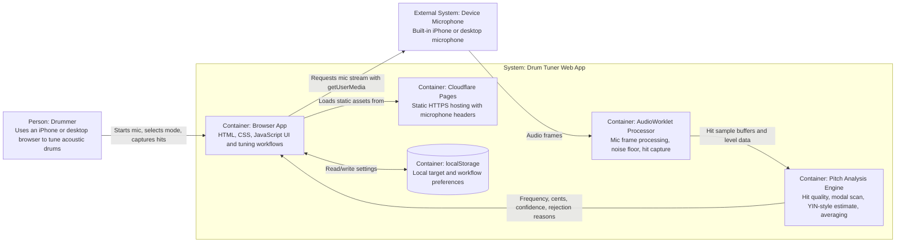

# Architecture

## Overview

Drum Tuner is a static, client-side web app. Cloudflare Pages serves HTML, CSS, JavaScript, Cloudflare headers, and PWA metadata over HTTPS. Once loaded, the browser owns the runtime: microphone permission, audio capture, hit detection, pitch analysis, UI updates, and local settings persistence all happen on the user's device.

There is no application backend. That is intentional for the live tuning path: server-side audio analysis would add latency, require uploading microphone audio, and make the tuner less reliable when network conditions change.

## C4-Style Container Diagram



## Runtime Flow

1. The user opens the HTTPS Cloudflare Pages URL.
2. The browser loads `index.html`, `styles.css`, `app.js`, `drum-audio-worklet.js`, and `manifest.webmanifest`.
3. When the user taps `Start mic`, the app requests microphone access with `navigator.mediaDevices.getUserMedia`.
4. The app creates a Web Audio graph with an `AnalyserNode` and, when available, an `AudioWorkletNode`.
5. The `AudioWorklet` tracks level, noise floor, pre-roll, hit capture windows, clipping, and cooldown.
6. Captured hit samples are sent to the main thread for hit-quality scoring and pitch analysis.
7. The pitch path combines modal-frequency scanning and YIN-style estimation, applies confidence thresholds, and rejects unstable readings.
8. Accepted readings update the active workflow: pitch tuning, lug tuning, or batter/resonant head matching.
9. User settings are persisted in `localStorage`; microphone audio is not uploaded.

## Deployment Shape

- Hosting: Cloudflare Pages
- Build step: none
- Deployed assets: repository root
- Production URL: [https://drum-tuner.pages.dev](https://drum-tuner.pages.dev)
- Deployment command:

```sh
npx wrangler pages deploy . --project-name drum-tuner --branch main
```

Cloudflare Pages applies `_headers` so the browser can request microphone permission from the app origin.

## Key Constraints

- iPhone Safari requires HTTPS for microphone access.
- Browser and operating system audio processing may vary even when the app requests disabled echo cancellation, noise suppression, and automatic gain control.
- Drum sounds are impulsive and inharmonic, so the app uses modal peak tracking and repeated-hit averaging rather than relying on one frequency estimator.
- The current app is intentionally backend-free; cloud sync, user accounts, and shared presets would require adding a backend or managed storage service.
- Accuracy claims require field validation against real drums, rooms, iPhone models, and reference tuners.
